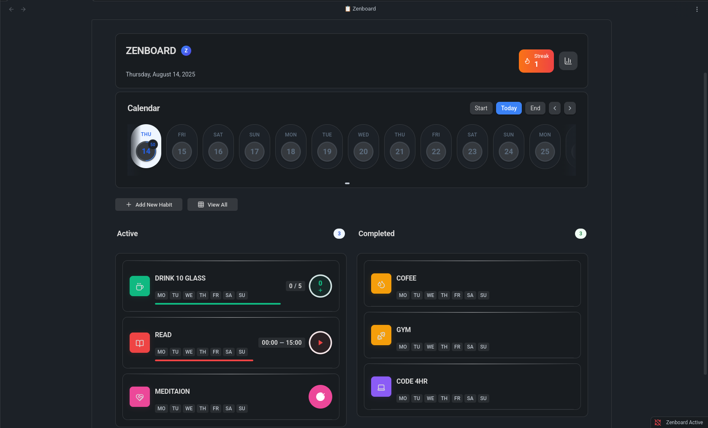
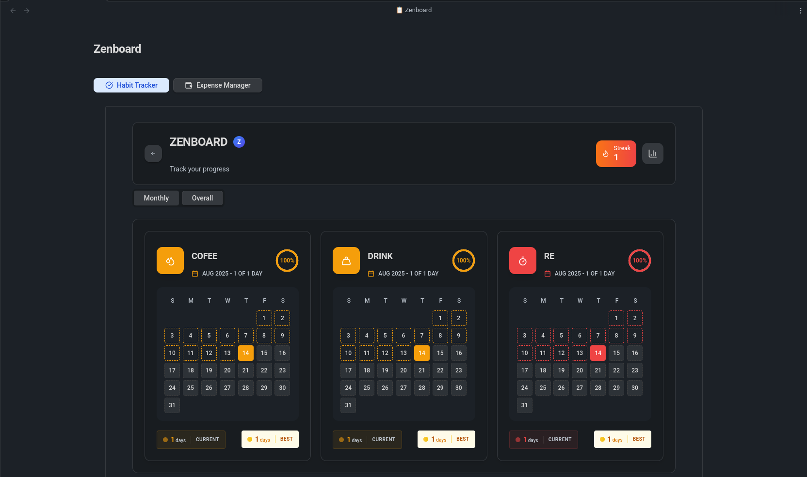
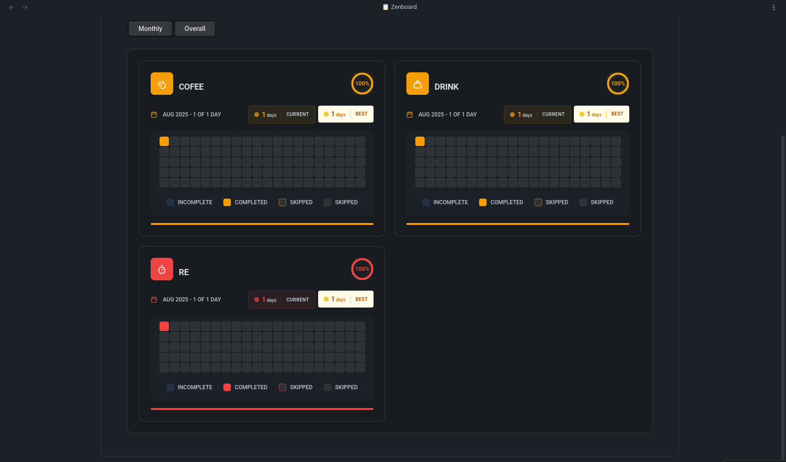
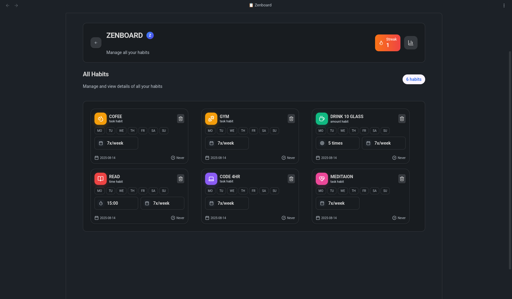

# Habit Tracker – Zenboard

Habit Tracker – Zenboard is an Obsidian plugin that helps you build and maintain consistent daily habits directly inside your vault.  
Track your progress, visualize streaks, and stay motivated – all without leaving Obsidian.

## Features

- 📅 **Flexible habit types** – daily, weekly, or custom intervals
- 📊 **Progress tracking** – streak counters and visual charts
- ⚡ **Quick logging** – via ribbon icon, dashboard, or command palette
- 🎯 **Customizable goals** – set and edit targets anytime
- 🗂 **Vault-first storage** – all data is saved locally in your vault
- 🌗 **Obsidian theme support**

## How to Use

1. Install and enable **Habit Tracker – Zenboard** from  
   **Settings → Community plugins → Browse**.
2. Open the dashboard via the ribbon icon or:
   - Command Palette → `Open Habit Dashboard`
3. Add your first habit with **+ Add Habit**.
4. Log progress daily and watch your streak grow.

> **Tip:** You can pin the dashboard as a side pane for quick access.

## Screenshots

### Dashboard


### Monthly Analytics 


### Yearly Analytics 


### All Habits View 



## For Developers

If you want to contribute or customize the plugin:

```bash
# Clone the repository into your vault’s plugins folder
git clone https://github.com/shadabdullah/obsidian-zenboard .obsidian/plugins/zenboard

cd .obsidian/plugins/zenboard
npm install

# Development: watch JS + Tailwind CSS for live updates
npm run dev:watch

# Build once for production (generates JS + CSS)
npm run build

# Clean build: remove old files and rebuild everything
npm run clean-build
